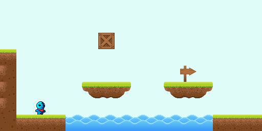

# 2D Platformer using ECS

## Description

**For a more lengthy explanation, you can read the
[post](https://sanderl.be/posts/2d-platformer-ecs/) I wrote about this on my
website.**

A 2D platformer written in TypeScript using the ECS (Entity Component System)
pattern. The concepts used are greatly inspired by the [online
course](https://www.youtube.com/watch?v=s99UDGdYIUE&list=PL_xRyXins84_Jf-aCh7chj47HR4oZLPwK)
"Intro to C++ Game Programming (COMP4300)" by [Dave
Churchill](https://www.cs.mun.ca/~dchurchill/) of the Memorial University in
Newfoundland, Canada.

[Check out the demo](https://sanderledegen.github.io/2d-platformer-ecs/)

## Installation

If you're keen on trying this locally, install the dependencies using your
favourite package manager (npm in this case) and fire up the local dev server
(Vite):

`npm i`

`npm run start`

## Things to improve or add

Of course, this isn't a fully finished game. My main goal was to explore how ECS
can be used to create a platformer. Even though the foundation is there, a lot
of improvements still could be made. A non-exhaustive list of nice additions:

- Camera system; this will enable you to create bigger levels with a camera
  centering or following the player on the screen.
- Implement actions; instead of binding specific keys to the game logic, tie
  them to actions and act upon those actions in the game logic. Adding support
  for game controllers, for example, results into a cleaner architecture.
- Implement a proper game loop; right now, I don't take the
  `requestAnimationFrame`'s delta time into account, making the game run faster
  on high refresh rate monitors.
- Performance and code structure; I did not focus too much on performance or
  code structure. Instead, I wanted to see this pattern work as soon as
  possible.

## Utils

There were some handy websites I used to alter spritesheets to fit my needs.

- http://kuut.xyz/spritesheet/
- https://ezgif.com/crop/

## Credits

Thanks to the creative people out there who make their work freely available!

- [Free tiny hero sprites pixel art](https://free-game-assets.itch.io/free-tiny-hero-sprites-pixel-art)
- [Craftpix](https://craftpix.net/)
- [Kenney](https://kenney.nl/)
